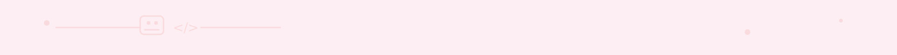

<h1 align="center">Hi I'm Zedjiga </h1>

<!-- Intro -->

    
    <h3 align="center">Love Tech, love learning and share my knowledges.</h3>
    <h3 align="center">I'm a web developper</h3>

## 👩‍💻 About Me

Hi! I'm **Zedjiga**, a passionate **Full Stack Web Developer** who loves building clean, dynamic, and user-centered web applications.

Curious by nature, I enjoy learning new technologies, solving problems, and creating meaningful digital experiences.  
Always motivated to grow, collaborate, and bring ideas to life! ✨

🌸 **Curious** • 💻 **Tech-Driven** 

---

## 🔗 My Links
*   [GitHub](https://github.com/zedjiga-naitdjoudi) → https://github.com/zedjiga-naitdjoudi
*   [LinkedIn](https://linkedin.com/in/zedjiga-nait-djoudi-025b09327) → https://linkedin.com/in/zedjiga-nait-djoudi-025b09327
*   [Instagram](https://www.instagram.com/zzjcanfly) → https://www.instagram.com/zzjcanfly

---

## 🛠️ Languages & Tools

  

